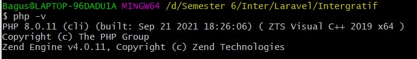
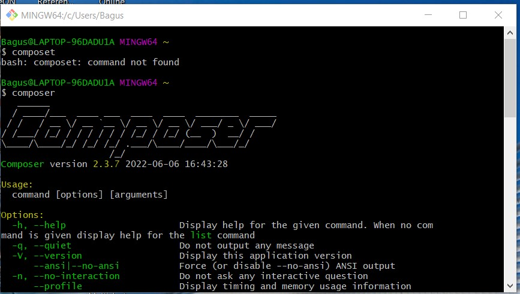
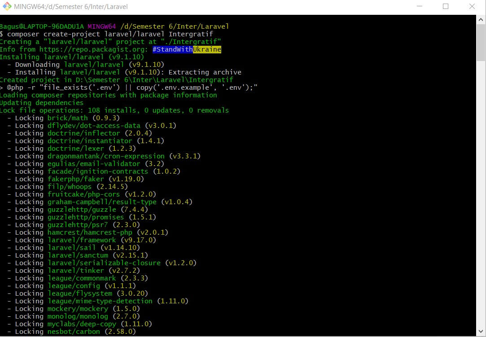
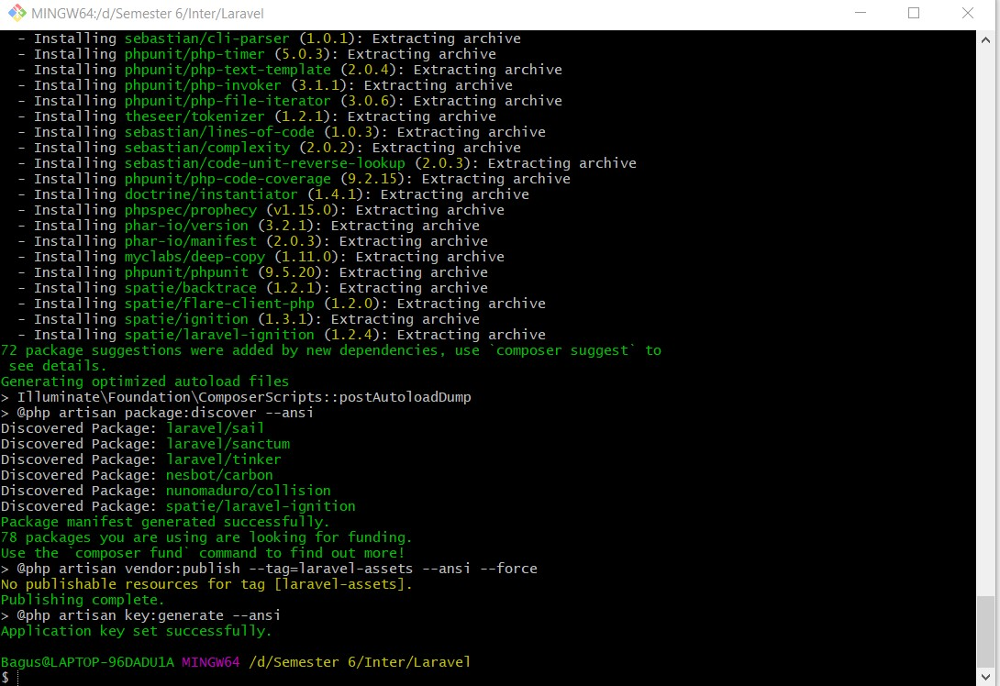
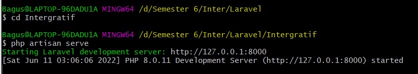
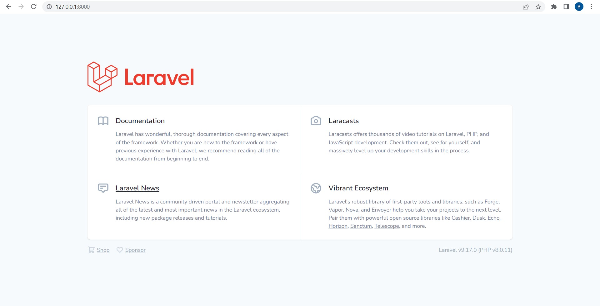

#  Tugas Besar - Integratif
Bagus Setiawan || 1202199008 || IT-02-01

# Final Project Fase 1
------

## Step by Step

------
1. Install php versi 7.0 ke atas



2. Install Composer pada ```getcomposer.org```, dan lakukan instalasi seperti biasa.


  
3. Buka Folder Laravel dan buka memalui ```cmd / powershell / gitbash```

.png)

4. Install laravel menggunakan perintah ``` composer create-project laravel/laravel nama_project``` tunggu sampai selesai.




5. Masuk kedalam Folder Project Laravel yang dibuat menggunakan ```cd nama file``` didalam CMD
6. Dan jalankan project dengan command ``` php artisan serve```



7. Buka browser dan buka https yang ada cmd
8. Laravel sudah bisa digunakan


